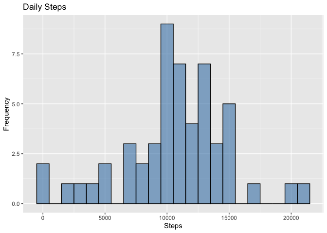
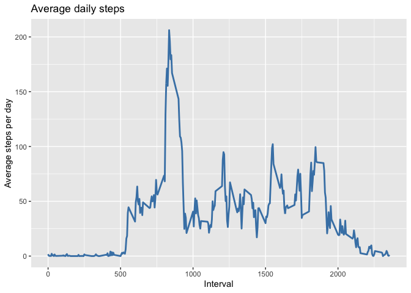
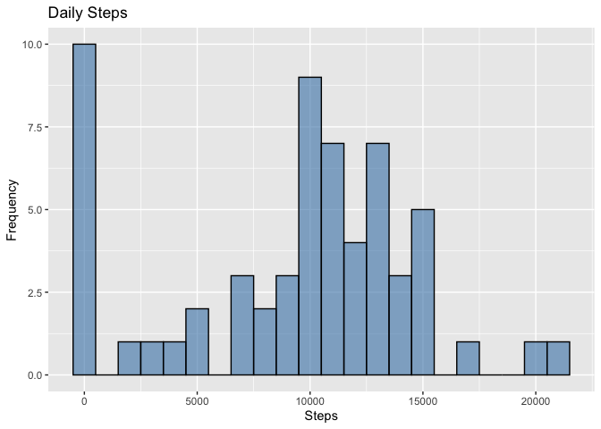
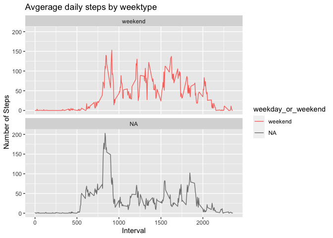

## Load libraries

```r
library("data.table")
library(ggplot2)
```

## Loading and preprocessing the data
Unzip data to obtain a csv file.


```r
unzip("activity.zip",exdir = "data")
activity <- data.table::fread(input = "data/activity.csv")
```


## What is mean total number of steps taken per day?

```r
steps <- activity[, c(lapply(.SD, sum, na.rm = FALSE)), .SDcols = c("steps"), by = .(date)] 
head(steps, 10)
```

```
##           date steps
##  1: 2012-10-01    NA
##  2: 2012-10-02   126
##  3: 2012-10-03 11352
##  4: 2012-10-04 12116
##  5: 2012-10-05 13294
##  6: 2012-10-06 15420
##  7: 2012-10-07 11015
##  8: 2012-10-08    NA
##  9: 2012-10-09 12811
## 10: 2012-10-10  9900
```
Histogram

```r
ggplot(steps, aes(x = steps)) +
    geom_histogram(fill = "steelblue", binwidth = 1000, alpha=0.6, color='black') +
    labs(title = "Daily Steps", x = "Steps", y = "Frequency")
```

```
## Warning: Removed 8 rows containing non-finite values (stat_bin).
```



mean and median of the total number of steps taken per day

```r
steps[, .(mean = mean(steps, na.rm = TRUE), median = median(steps, na.rm = TRUE))]
```

```
##        mean median
## 1: 10766.19  10765
```

## What is the average daily activity pattern?
Time series plot of the average number of steps taken

```r
interval <- activity[, c(lapply(.SD, mean, na.rm = TRUE)), .SDcols = c("steps"), by = .(interval)] 
ggplot(interval, aes(x = interval , y = steps)) + geom_line(color="steelblue", size=1) + labs(title = "Average daily steps", x = "Interval", y = "Average steps per day")
```



The 5-minute interval that, on average, contains the maximum number of steps

```r
interval[steps == max(steps), .(max_interval = interval)]
```

```
##    max_interval
## 1:          835
```


## Imputing missing values
Calculate and report the total number of missing values in the dataset (i.e. the total number of rows with NA\color{red}{\verb|NA|}NAs)

```r
nrow(activity[is.na(steps),])
```

```
## [1] 2304
```


Devise a strategy for filling in all of the missing values in the dataset. The strategy does not need to be sophisticated. For example, you could use the mean/median for that day, or the mean for that 5-minute interval, etc.

```r
activity[is.na(steps), "steps"] <- activity[, c(lapply(.SD, median, na.rm = TRUE)), .SDcols = c("steps")]

activity
```

```
##        steps       date interval
##     1:     0 2012-10-01        0
##     2:     0 2012-10-01        5
##     3:     0 2012-10-01       10
##     4:     0 2012-10-01       15
##     5:     0 2012-10-01       20
##    ---                          
## 17564:     0 2012-11-30     2335
## 17565:     0 2012-11-30     2340
## 17566:     0 2012-11-30     2345
## 17567:     0 2012-11-30     2350
## 17568:     0 2012-11-30     2355
```

Create a new dataset that is equal to the original dataset but with the missing data filled in.

```r
fwrite(x = activity, file = "data/activity_clean.csv", quote = FALSE)
```


Make a histogram of the total number of steps taken each day and Calculate and report the mean and median total number of steps taken per day. Do these values differ from the estimates from the first part of the assignment? What is the impact of imputing missing data on the estimates of the total daily number of steps?


```r
steps_cln <- activity[, c(lapply(.SD, sum)), .SDcols = c("steps"), by = .(date)] 
steps_cln[, .(mean = mean(steps), median = median(steps))]
```

```
##       mean median
## 1: 9354.23  10395
```

```r
steps_cln |>
    ggplot(aes(x = steps)) + geom_histogram(fill = "steelblue", binwidth = 1000, alpha=0.6, color='black') + labs(title = "Daily Steps", x = "Steps", y = "Frequency")
```




```r
summary(steps)
```

```
##       date                steps      
##  Min.   :2012-10-01   Min.   :   41  
##  1st Qu.:2012-10-16   1st Qu.: 8841  
##  Median :2012-10-31   Median :10765  
##  Mean   :2012-10-31   Mean   :10766  
##  3rd Qu.:2012-11-15   3rd Qu.:13294  
##  Max.   :2012-11-30   Max.   :21194  
##                       NA's   :8
```

```r
summary(steps_cln)
```

```
##       date                steps      
##  Min.   :2012-10-01   Min.   :    0  
##  1st Qu.:2012-10-16   1st Qu.: 6778  
##  Median :2012-10-31   Median :10395  
##  Mean   :2012-10-31   Mean   : 9354  
##  3rd Qu.:2012-11-15   3rd Qu.:12811  
##  Max.   :2012-11-30   Max.   :21194
```


## Are there differences in activity patterns between weekdays and weekends?
Create a new factor variable in the dataset with two levels – “weekday” and “weekend” indicating whether a given date is a weekday or weekend day.


```r
# Just recreating activityDT from scratch then making the new factor variable. (No need to, just want to be clear on what the entire process is.) 
activity <- data.table::fread(input = "data/activity.csv")
activity[, date := as.POSIXct(date, format = "%Y-%m-%d")]
activity[, day_of_week:= weekdays(x = date)]
activity[grepl(pattern = "Monday|Tuesday|Wednesday|Thursday|Friday", x = day_of_week), "weekday or weekend"] <- "weekday"
activity[grepl(pattern = "Saturday|Sunday", x = day_of_week), "weekday_or_weekend"] <- "weekend"
activity[, weekday_or_weekend := as.factor(weekday_or_weekend)]
head(activity, 10)
```

```
##     steps       date interval day_of_week weekday or weekend weekday_or_weekend
##  1:    NA 2012-10-01        0      Monday            weekday               <NA>
##  2:    NA 2012-10-01        5      Monday            weekday               <NA>
##  3:    NA 2012-10-01       10      Monday            weekday               <NA>
##  4:    NA 2012-10-01       15      Monday            weekday               <NA>
##  5:    NA 2012-10-01       20      Monday            weekday               <NA>
##  6:    NA 2012-10-01       25      Monday            weekday               <NA>
##  7:    NA 2012-10-01       30      Monday            weekday               <NA>
##  8:    NA 2012-10-01       35      Monday            weekday               <NA>
##  9:    NA 2012-10-01       40      Monday            weekday               <NA>
## 10:    NA 2012-10-01       45      Monday            weekday               <NA>
```


Make a panel plot containing a time series plot of the 5-minute interval (x-axis) and the average number of steps taken, averaged across all weekday days or weekend days (y-axis). See the README file in the GitHub repository to see an example of what this plot should look like using simulated data.


```r
activity[is.na(steps), "steps"] <- activity[, c(lapply(.SD, median, na.rm = TRUE)), .SDcols = c("steps")]


interval <- activity[, c(lapply(.SD, mean, na.rm = TRUE)), .SDcols = c("steps"), by = .(interval, weekday_or_weekend)] 

interval |>
    ggplot(aes(x = interval , y = steps, color=weekday_or_weekend)) +
    geom_line() +
    labs(title = "Avgerage daily steps by weektype", x = "Interval", y = "Number of Steps") +
    facet_wrap(~weekday_or_weekend , ncol = 1, nrow=2)
```


